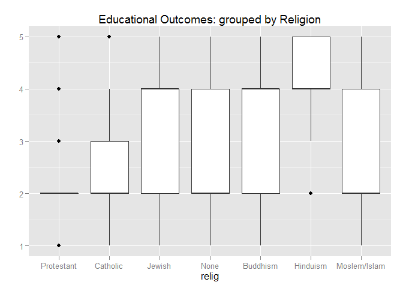
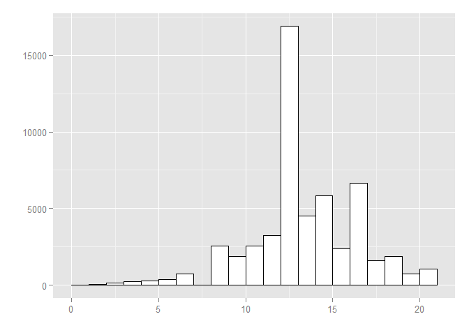
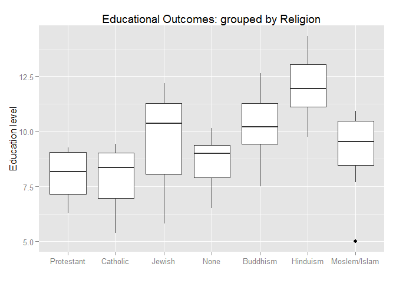
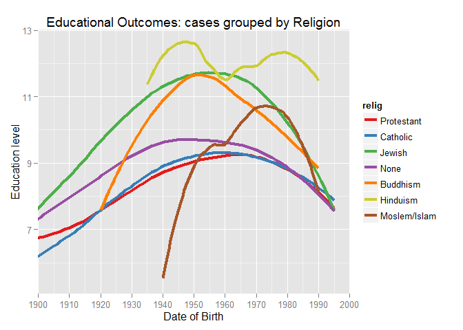

# chris GSS stats project. religion & degree
april 12 2015  


### Introduction

I'm interested in using the GSS dataset to investigate the how educational attainment varies across religious affliliation.
Educational success is a good indicator of the economic prospects of different sections of society, as well as of cultural cohesion and integration.

### Data

The data come from the General Social Surveys (GSS), which are interviews administered to National Opinion Research Center (NORC) national samples using a standard questionnaire. 

The GSS have been conducted every year or two from 1972-2012, around 1500 participants each year. Their interviews, with "an independently drawn sample of English-speaking persons 18 years of age or over, living in non-institutional arrangements within the United States" last about 1.5 hours. The exact questionnaire, sampling method, etc have changed somewhat year to year. 

The 57,061 cases are individual respondents to the survey over the years 1972-2012. I have used all of their cases which have complete data on my chosen variables, and from all sample years. 

I selected 2 variables:

* Religion gss\$relig. I have subsetted out the main affiliations from the dataset: Protestant, Catholic, Jewish, None, Buddhism, Hinduism, Moslem/Islam. Religion is a categorical variable with 7 levels. 

* Educational Attainment. Principally I use the respondent's highest degree gss\$degree, but have attempted to weight this, for reasons discussed below, using the respondent's years in fulltime education gss\$educ. Degree is an ordinal categorical, levels 1 to 5. When weighted it becomes a continuous numerical.

The GSS is an observational study: all participants were treated the same, and no experimental manipulation was done.

Although the GSS samples people from all ethnicities, religions and classes, generalizability of my inferences about educational persistence and success to the whole US population may not be perfect: since only English-speakers are sampled, there may be a population of non-English speakers who fail in education, but who are not sampled. As it stands my study may only be sampling the triers and the winners. 
When considering minority religions, the sample size may be insufficient to be representative. 

I cannot make causal links from this study: the GSS is an observational study and not an experiment. As such, it can only establish correlation.

### Exploratory data analysis


```r
#load, tidy, subset data
load(url("http://bit.ly/dasi_gss_data"))
library(dplyr, warn.conflicts = FALSE, quietly = TRUE); library(ggplot2)
```

```
## Warning: package 'dplyr' was built under R version 3.1.3
```

```r
educ <- is.na(gss$educ) | is.na(gss$age) | is.na(gss$degree) | is.na(gss$year) | gss$educ<1
gs <- gss[!educ, ]
gs <- select(gs,year,age,sex,relig,educ,degree)
relig <- c("Protestant","Catholic","Jewish","None","Buddhism","Hinduism","Moslem/Islam")
userelig <- gs$relig %in% relig
gs <- gs[userelig, ]
gs$relig <- factor(gs$relig)  # drop unused factors
gs$degree <- as.numeric(gs$degree) #1=lowest, 5=grad

# first boxplot
yformat <- function(y){ levels(gss$degree)[y] }

colrs <- c('#e41a1c', '#377eb8', '#4daf4a', '#984ea3', '#ff7f00', '#cccc33', '#a65628')
ggplot(gs, aes(x=relig, y=degree)) + geom_boxplot() +
  #scale_y_continuous(label=yformat) + 
  labs(y="") +
	ggtitle("Educational Outcomes: grouped by Religion")
```

 

The measure of education success is very crude: only 5 levels to account for up to 20 years study. The spread of years-in-education is shown in this plot


```r
ggplot(gs, aes(x=educ)) + geom_histogram(binwidth=1, colour="black", fill="white") + labs(y="", x="") 
```

 

It seems unlikely that those attaining only a basic High School qualification are only one fifth as intelligent as graduates, so I want to provide a weighting to the \$degree to reflect this. I decided to use gs\$degree + gs\$educ/2. The histogram above shows peaks at 8, 12, 14 and 16 years, which represent the first 4 degree levels. So effectively degree levels are weighted 9, 14, 17, 20, 23.
The boxplot now becomes:


```r
gs$degW <- gs$degree + gs$educ/2
gs$dob <- gs$year - gs$age
gs$dob5 <- round(gs$dob/5)*5
gg1 <- gs %>% group_by(relig, dob5) %>% summarize(val=mean(degree), count=n())
gg1a <- gs %>% group_by(relig, dob5) %>% summarize(val=mean(degW), count=n())
ggplot(gg1a, aes(x=relig, y=val)) + geom_boxplot() +
  labs(y="Education level", x="") +
	ggtitle("Educational Outcomes: grouped by Religion")
```

 

### Inference

##### Hypothesis

I'm not sure an ANOVA analysis is possible on the \$degW statistic, because not all the conditions for the method (particularly normality of group sample distributions) were satisfied, so I return to the original \$degree statistic: 

* H0 - Religion and degree level are uncorrolated. 
* H1 - Religion and degree level are corrolated, the group means are significantly different.

##### Hypothesis Test

We have 2 categorical variables, both of which have more than 2 levels, so will use the chi square Independence test. 

##### Conditions for Chi Square Test
* random assignment/sampling? GSS uses ramdom sampling of idependent participants, so this is satisfied.
* <10% of population sampled if sampling without replacement? OK
* each case only contributes to one cell on the table? OK
* sample size: each cell must have >=5 cases?


```r
table(gs$relig, gs$degree)
```

```
##               
##                    1     2     3     4     5
##   Protestant    7422 17439  1640  4173  1876
##   Catholic      2792  7242   809  1941   829
##   Jewish          95   395    47   317   276
##   None           992  2948   370  1094   621
##   Buddhism        16    39     5    47    21
##   Hinduism         0    11     3    23    25
##   Moslem/Islam    14    42    13    21    17
```

We have insufficient cases among the Hindu[ists] and the Bhuddists, so we remove these, before proceeding. 
    

```r
HiBu <- gs$relig==relig[5] | gs$relig==relig[6]
gs2 <- gs[!HiBu, ]
gs2$relig <- factor(gs2$relig)  # drop unused factors

data <- table(gs2$relig, gs2$degree)
rowsum <- rowSums(data); colsum <- colSums(data)
totsum <- sum(rowsum)
expected <- sapply(colsum, function(col){ round(sapply(rowsum, function(row){ row*col/totsum })) })
#expected
#for(i in 1:nrow(data)){ obs<-data[i, ]; exp<-expected[i, ]; dframe<-cbind(obs,exp); 
#  x <- chisq.test(dframe); print(paste(relig[i],', Xsquare=', round(x[[1]]),', p-value=', round(x[[3]],4),sep="")) }

chistat <- sum((data - expected)^2 / expected)
df <- (nrow(data)-1) * (ncol(data) -1)
p <- pchisq(chistat, df, lower.tail=FALSE)
print(paste('p-value = ',p,'.',sep=""))
```

```
## [1] "p-value = 5.20968477043984e-264."
```

### Conclusion

This p-value is very tiny, so we conclude that the 5 remaining groups really have different means, implying definite cultural differences. It would be interesting to see if this result holds up when considering religiosity or devoutness, rather than a broad cultural identification with a religious tradition. As seen below, the massed result of all cases from all years breaks down if looked at as a time series. For the cohort born after 1990 the outperformance of some minority religions seems to be reversing.

### Reference 

Smith, Tom W., Michael Hout, and Peter V. Marsden. General Social Survey, 1972-2012 [Cumulative File]. ICPSR34802-v1. Storrs, CT: Roper Center for Public Opinion Research, University of Connecticut /Ann Arbor, MI: Inter-university Consortium for Political and Social Research [distributors], 2013-09-11. 

Persistent URL: http://doi.org/10.3886/ICPSR34802.v1

### Appendix 1


```r
# part of the subsetted dataset
tail(gs,15)
```

```
##       year age    sex      relig educ degree degW  dob dob5
## 57047 2012  63   Male Protestant   16      4 12.0 1949 1950
## 57048 2012  20 Female       None   14      2  9.0 1992 1990
## 57049 2012  71   Male   Catholic   12      2  8.0 1941 1940
## 57050 2012  50   Male Protestant   14      2  9.0 1962 1960
## 57051 2012  23 Female       None   14      2  9.0 1989 1990
## 57052 2012  65 Female       None   19      5 14.5 1947 1945
## 57053 2012  60   Male Protestant    8      1  5.0 1952 1950
## 57054 2012  69 Female     Jewish    9      1  5.5 1943 1945
## 57055 2012  78   Male Protestant    9      1  5.5 1934 1935
## 57056 2012  25 Female   Catholic   11      1  6.5 1987 1985
## 57057 2012  61 Female       None   16      4 12.0 1951 1950
## 57058 2012  53 Female   Catholic   13      2  8.5 1959 1960
## 57059 2012  48   Male   Catholic   13      2  8.5 1964 1965
## 57060 2012  37 Female   Catholic   12      2  8.0 1975 1975
## 57061 2012  22   Male Protestant   12      2  8.0 1990 1990
```

### Appendix 2

Here, just for interest, is a time series plot of degree level, by religion. This uses the weighted degree statistic. The downturn since 1980 perhaps represents increasing fees, which necessitates part-time study, and perhaps incomplete education in younger cohorts, increasing educational standards, alienation. The steeper downturn, from much higher attainment levels, of minority religions, is quite striking, as is the holding-up of the Hindus:


```r
ggplot(gg1a, aes(x=dob5, y=val, color=relig, size=count), alpha = 0.4) + 
  #geom_point() + 
	geom_smooth(method=loess, se=FALSE, size=1.5) +
	coord_cartesian(xlim=c(1900, 2000)) + 
	labs(x="Date of Birth", y="Education level")  +
	scale_x_continuous(breaks=seq(1900,2000,10)) +
	#scale_y_continuous(label=yformat) +
	scale_colour_manual(values=colrs) +
	ggtitle("Educational Outcomes: cases grouped by Religion")
```

 

